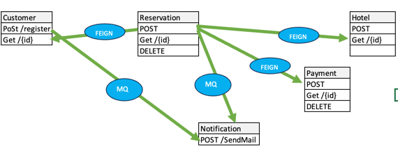

# Spring Microservices in Action
Microservices developed here showcase some patterns like API Gateway, Event-Driven, Service Discovery, Circuit Breaker, etc.

Following are the microservices developed here:
- [x] **Customer Service**:
  - This service exposes 2 REST endpoints to create and retrieve customer details. 
  - It also publishes customer created event to Kafka topic.
- [x] **Reservation Service**: 
  - This service exposes 3 REST endpoints to create, retrieve and delete reservation details. 
  - Also communicates with 
    - Customer Service to retrieve customer details, 
    - payment service to make payment, and 
    - hotel management service to check room availability. 
  - It also publishes reservation created event to Kafka topic.
- [x] **Hotel management Service**: 
  - This service exposes 2 REST endpoints to create and retrieve hotel details. 
- [x] **Payment Service**: 
  - This service exposes 3 REST endpoints to make payment, retrieve payment details and refund payment.
- [x] **Notification Service**
  - This service consumes customer created and reservation created events from Kafka topic and stores in DB.


- [x] **API Gateway Service**
  - This is the common gateway for all the above microservices.
- [x] **Discovery Service**
  - This service is used for service discovery.

### URLs
- [x] **API Gateway Service**: http://localhost:8080
- [x] **Customer Service**: http://localhost:8081/api/customers
- [x] **Reservation Service**: http://localhost:8082/api/reservations
- [x] **Hotel Management Service**: http://localhost:8083/inventory
- [x] **Payment Service**: http://localhost:8084/payments
- [x] **Notification Service**: Listens to Kafka topic

Swagger is configured for all the above services. You can access it using the following URLs:
- [x] **Customer Service**: http://localhost:8081/swagger-ui.html
- [x] **Reservation Service**: http://localhost:8082/swagger-ui.html
- [x] **Hotel Management Service**: http://localhost:8083/swagger-ui.html
- [x] **Payment Service**: http://localhost:8084/swagger-ui.html

### Kafka Setup:
Kafka is configured using docker-compose. To start Kafka, run the following command
```
cd kafka-docker
docker-compose up -d
```

This starts kafka and zookeeper containers. These can be accessed using the ports 29092 and 22181 respectively.

### Business Flow

#### User Creation
1. Create a customer using the customer service. This publishes a customer created event to Kafka topic.
2. Notification service consumes the customer created event and stores it in DB.

**URL**: http://localhost:8080/api/customers (POST)

**Sample Request**:
```
{
    "name": "Vamsi Krishna",
    "email": "bhagivamsi@gmail.com",
    "password": "secret_str0ng_p@ssword"
}
```
#### Reservation 
1. Create a reservation using the reservation service.
2. Calls the customer service to retrieve customer details.
3. Calls the hotel management service to check room availability.
4. Calls the payment service to make payment.
5. Updates hotel inventory.
6. Creates an entry in reservation table.
7. Finally publishes a reservation created event to Kafka topic.


**URL**: http://localhost:8080/api/reservations (POST)

**Sample Request**:
```
{
    "customerId": 1,
    "hotelId":2,
    "startDate":"2023-12-13",
    "endDate":"2023-12-23"
}
```

_Saga pattern is implemented for the above flow. If any of the above steps fail, the entire flow is rolled back._

#### Reservation Cancellation
1. Delete a reservation using the reservation service.
2. Calls the customer service to retrieve customer details.
3. Calls the hotel management service to check room availability.
4. Calls the payment service to refund payment.
5. Updates hotel inventory.
6. Updates reservation table with status as cancelled.
7. Finally publishes a reservation cancelled event to Kafka topic.

**URL**: http://localhost:8080/api/reservations/{reservationId} (DELETE)


Below flow diagram shows the user creation and reservation flow. Similar flow is implemented for reservation cancellation as well.
